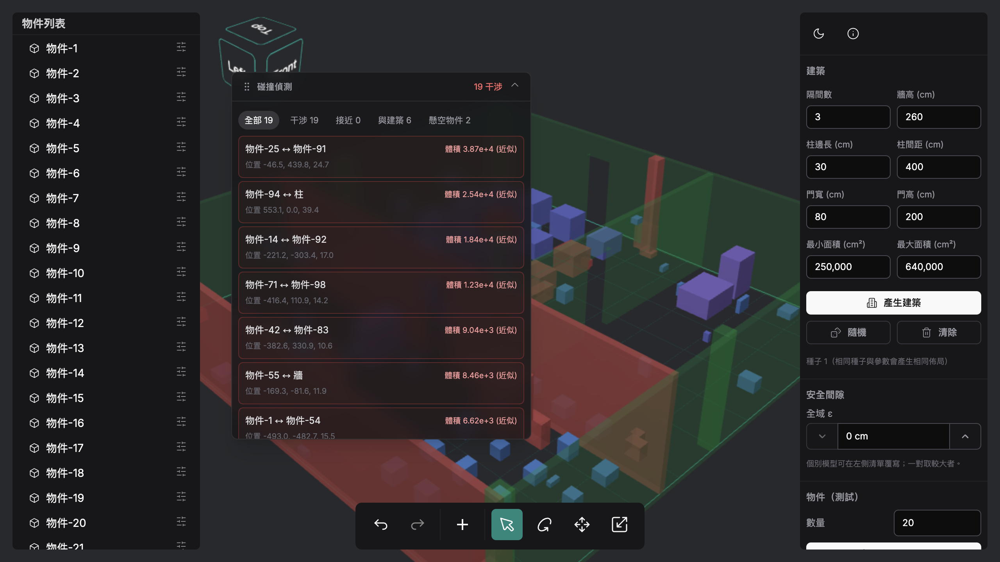
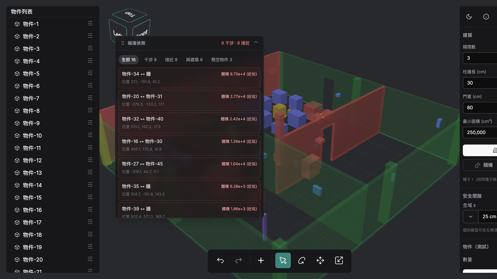
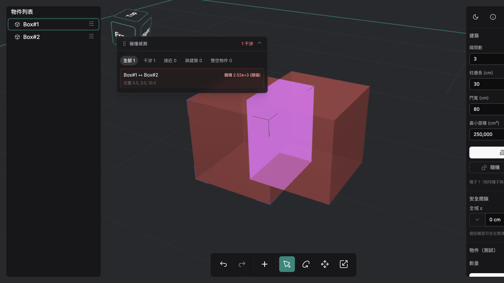
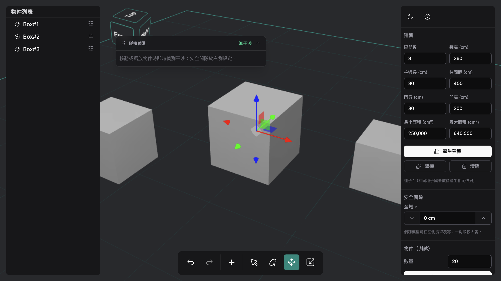

# nexis

大範圍場域的**碰撞／干涉檢測**前端。在瀏覽器中以三角網格（Mesh）表示廠房建築與設備物件，即時偵測物件之間、以及物件與建築之間的干涉，並標示**位置（Location）**與**量化大小（Magnitude）**，協助佈局設計在套用到真實場域前先驗證。

純前端 SPA，無後端、可直接部署為靜態網站。

🔗 **線上 Demo**：<https://nexis.max-the-solution.com>



---

## 功能總覽

| 類別 | 功能 |
|---|---|
| **干涉偵測** | 物件 vs 物件、物件 vs 建築；即時更新；標示干涉（紅）與接近（黃） |
| **量化** | AABB 重疊體積快速近似；點選後以 CSG 布林交集算**精確交集體積**並畫出交集區域 |
| **安全間隙 ε** | 全域門檻 + 逐物件覆寫；間距 < ε 標為「接近」並畫最近點連線 |
| **三維** | 部分物件懸空於隨機高度，呈現立體干涉而非平面 |
| **建築** | 程序化生成半透明牆、門洞與結構柱網（可調參數） |
| **規模化** | R-tree broad phase + BVH narrow phase，數千物件仍可即時偵測 |
| **編輯** | 單一模型選取 + 變換（移動／旋轉／平移／縮放）、Undo/Redo、多選刪除、匯入 STL/OBJ |
| **面板** | 浮動可拖曳碰撞面板，分類過濾 + 虛擬捲動清單 |

單位：公分（cm）。

---

## 功能導覽

### 程序化建築生成


右側「建築」面板設定參數（隔間數、牆高、柱邊長、門寬／門高、隔間面積、最小柱距）後按 **產生建築**，即生成半透明的牆、門洞與結構柱網。建築的每一片牆與每一根柱都是碰撞對象，會與擺放的物件互測。

### 即時干涉偵測與規模化


「物件（測試）」面板設定數量後按 **隨機生成物件**，模擬系統自動佈點（上圖為 100 個）。引擎以**兩階段**偵測：R-tree broad phase 用 XY footprint 找出空間鄰近候選，BVH narrow phase 再做三角級精確判定，數千物件仍能即時運行。左上浮動面板即時列出每一對干涉（紅）／接近（黃），並可用分類過濾：**全部 / 干涉 / 接近 / 與建築 / 懸空物件**。每一項都附**位置（Location）**與**量級（Magnitude）**。

### 安全間隙 ε 與接近偵測



右側「安全間隙」設定**全域 ε**（上圖 = 15 cm）；個別物件可在左側清單覆寫，一對取較大者。物件雖未相交，但間距小於 ε 時標為**接近（黃）**，並畫出兩者的**最近點連線**。上圖聚焦一個物件與建築**柱子**的接近（間隙 10 cm），碰撞面板已切到「**接近**」分類，可見物件 vs 柱、物件 vs 物件的近接配對。ε 設為 0 則只偵測真正相交。

### 量化大小：AABB 近似 → CSG 精確體積



干涉量級預設用 **AABB 重疊體積**快速近似（清單顯示「體積 … (近似)」）。**點選某個干涉項**，則以 `three-bvh-csg` 的布林交集（`Brush + Evaluator(INTERSECTION)` → `computeMeshVolume`）算出**真實交集體積**（顯示「體積 … (精確)」），並把**交集區域**以洋紅高亮畫在場景中——精準呈現干涉發生的位置與大小。匯入的 STL/OBJ 模型同樣支援。

### 單一模型編輯與 Undo/Redo



點選任一物件即選取，最底部工具列提供完整編輯能力：

- **變換工具**：移動（拖曳）、旋轉、平移、縮放——選取後在物件上顯示對應的 gizmo（上圖為平移的 RGB 三軸箭頭）。
- **Undo / Redo**：工具列左側的復原／重做鈕（或 `Cmd/Ctrl + Z`、`Cmd/Ctrl + Shift + Z`）；任何擺放、移動、刪除都可回溯，且 undo/redo 後會自動重算干涉。
- **匯入**：工具列的上傳鈕，或直接把 `STL`／`OBJ` 拖進視窗。
- **刪除**：選取後按 `Delete` / `Backspace`（多選會一起刪）。

---

## 操作說明

打開 <https://nexis.max-the-solution.com>（或本機 `npm run dev`）後：

1. **產生建築** — 右側「建築」面板設參數 → **產生建築**。
2. **散布物件** — 右側「物件（測試）」設數量 → **隨機生成物件**；**清空物件** 可清除。
3. **設定安全間隙 ε** — 右側設全域 ε；個別物件在左側清單覆寫。
4. **看碰撞結果** — 左上浮動面板即時列出干涉／接近，用分類過濾；**點選干涉項**算精確交集體積並高亮交集區域。
5. **編輯物件** — 點選物件 → 底部工具列切換移動／旋轉／平移／縮放；`Delete` 刪除；`Cmd/Ctrl+Z` 復原。
6. **匯入模型** — 拖入 `STL`／`OBJ` 一同參與偵測。

> 啟動後為空場景與格線地板（見 [`screenshots/home.png`](screenshots/home.png)），產生建築或物件後面板才出現。

---

## 技術棧

- **Vue 3 + Vite 6**、Pinia、Vue Router（hash 路由）
- **Three.js** — 場景 / 相機 / 控制 / 渲染（`src/three`）
- **three-mesh-bvh** — BVH 加速的 narrow phase（`intersectsGeometry`、`closestPointToGeometry`）
- **three-bvh-csg** — 精確交集體積（`computeMeshVolume`）
- **rbush** — R-tree broad phase（XY footprint）
- **PrimeVue 4 + Tailwind CSS** — UI
- 測試：**Vitest**（單元）、**Cypress**（e2e／煙霧測試／截圖）

---

## 碰撞檢測架構

兩階段，依情境權衡速度與精度：

1. **Broad phase**：所有可碰撞物（物件、建築部件）的世界 AABB 投影到 XY 平面，用 R-tree 找出空間鄰近的候選配對，避免 O(n²) 兩兩比對。
2. **Narrow phase**：對候選配對做三角級精確判定。
   - 相交：`intersectsGeometry()`（BVH，三角對三角）。
   - 接近（ε > 0）：`closestPointToGeometry()` 算最小間距與最近兩點。
   - 精確體積：以 `Brush + Evaluator(INTERSECTION)` 取交集網格 → `computeMeshVolume()`（按需，點選時才算）。

不同使用情境對應不同策略：

| 情境 | 方法 | 重點 |
|---|---|---|
| 高頻拖曳 | 增量重算——只重測被移動的物件對其他物件/建築 | 最小化每幀成本 |
| 高精度間隙 | `closestPointToGeometry` 最小距離 + 按需 CSG 精確體積 | 精度優先，計算集中在單一配對 |
| 大規模靜態 | R-tree broad phase + 共用高亮材質 + 結果上限 | 近線性、避免記憶體爆量 |

所有可碰撞物共用同一個「collidable」抽象（`{ geometry, matrixWorld }`），因此**程序生成的方塊、匯入的網格、建築部件可彼此互測**——narrow phase 只看幾何與變換矩陣，與物件來源無關。

更深入的設計見 [`ARCHITECTURE.md`](ARCHITECTURE.md)。

---

## 快速開始

```sh
npm install      # 安裝依賴（含 three-mesh-bvh / three-bvh-csg / rbush）
npm run dev      # 開發伺服器
npm run build    # 產出靜態檔到 dist/
npm run preview  # 預覽 build 結果
```

### 測試

```sh
npm run test:unit          # Vitest 單元測試
npx cypress run --e2e      # Cypress e2e（需 dev 伺服器在執行）
```

---

## 部署

- 純前端、**無後端**；`npm run build` 後將 `dist/` 丟到任何靜態主機即可。
- 使用 **hash 路由**，免伺服器 rewrite 規則。
- **不要**啟用 COEP/CORP 標頭（會阻擋外部 CDN 的 matcap 貼圖）；若需完全離線，把 matcap 自行放進 `public/`。
- Vercel：framework 選 Vite、build 指令 `npm run build`、output 目錄 `dist`。
- 線上 Demo 走 Cloudflare Tunnel + 本機靜態伺服器。

---

## 作者

Max Shih — [github.com/MaxShih147](https://github.com/MaxShih147)
