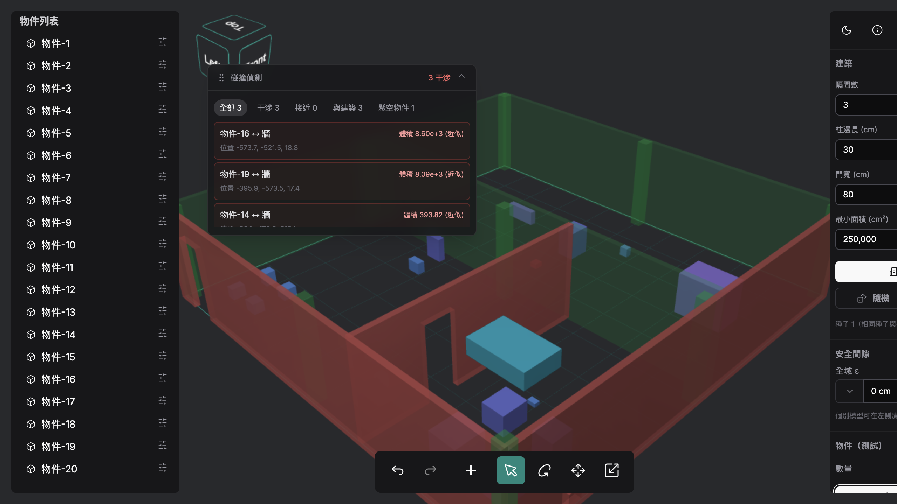
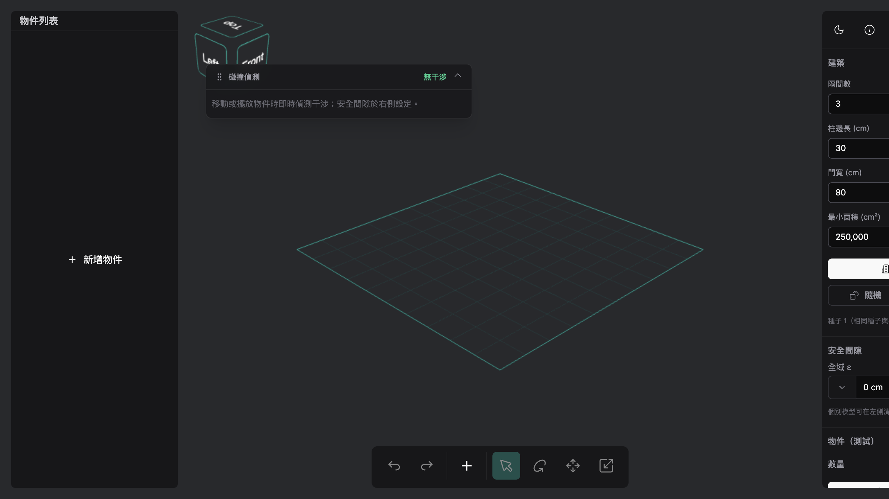
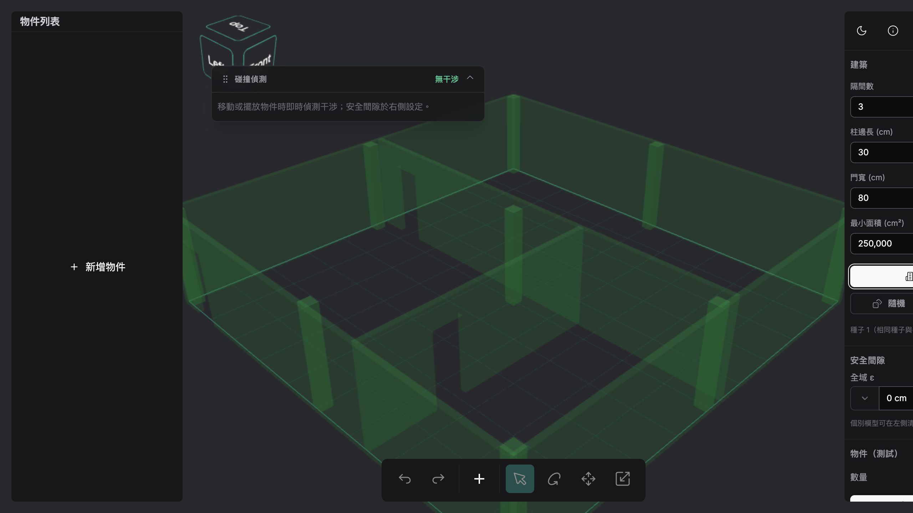

# nexis

大範圍數位孿生場域的**碰撞／干涉檢測**前端。在瀏覽器中以三角網格（Mesh）表示廠房建築與設備物件，即時偵測物件之間、以及物件與建築之間的干涉，並標示**位置（Location）**與**量化大小（Magnitude）**，協助佈局設計在套用到真實場域前先驗證。

純前端 SPA，無後端、可直接部署為靜態網站。

🔗 **線上 Demo**：<https://nexis.max-the-solution.com>



---

## 功能

- **即時干涉偵測**：拖曳／擺放物件時即時更新，標示干涉（紅）與接近（黃）。
- **物件 vs 物件、物件 vs 建築**：建築的牆與結構柱也是碰撞對象。
- **安全間隙 ε**：全域門檻 + 可逐物件覆寫；間距小於 ε 的配對標為「接近」，並畫出最近點連線。
- **量化大小**：
  - 預設用 AABB 重疊體積做快速近似。
  - 點選干涉項可用 **CSG 布林交集**算出**真實交集體積**（精確），並把交集區域畫在場景中（精準的 Location）。匯入的 STL/OBJ 模型也支援。
- **三維偵測**：少部分散布物件會**懸空**於隨機高度（頂部不超過牆高），呈現立體而非平面的干涉。
- **程序化建築生成**：依參數（隔間數、牆高、柱邊長、門寬/門高、隔間面積、最小柱距）生成半透明的牆、門洞與結構柱網。
- **規模化**：R-tree 寬相位 + BVH 窄相位，數千物件仍可即時偵測（結果上限保護）。
- **結果面板**：浮動、可拖曳；分類過濾（全部／干涉／接近／與建築／懸空物件）+ 虛擬捲動清單。
- **單位**：公分（cm）。

---

## 截圖

| 啟動畫面 | 程序化建築 | 干涉偵測 |
|---|---|---|
|  |  |  |
| 空場景與格線地板，右側為建築／安全間隙面板。 | 依參數生成半透明牆、門洞與結構柱網。 | 散布物件後，浮動面板即時列出干涉配對與量級。 |

---

## 操作說明

打開 <https://nexis.max-the-solution.com>（或本機 `npm run dev`）後：

1. **產生建築** — 右側「建築」面板設定參數（隔間數、柱邊長、門寬、最小面積…），按 **產生建築**。半透明的牆、門洞與結構柱會生成在場景中。
2. **散布物件** — 右側「物件（測試）」設定數量，按 **隨機生成物件**（模擬系統自動佈點，含少量懸空物件）；**清空物件** 可清除。
3. **設定安全間隙 ε** — 右側設定全域 ε；個別物件可在左側「物件列表」的齒輪鈕逐物件覆寫。間距小於 ε 的配對會被標為「接近」。
4. **看碰撞結果** — 左上「碰撞偵測」浮動面板即時列出干涉（紅）／接近（黃）；用上方分類過濾（全部／干涉／接近／與建築／懸空物件）。**點選某個干涉項** → 計算該配對的**精確交集體積**並在場景中高亮交集區域。
5. **匯入模型** — 直接把 `STL`／`OBJ` 檔拖進視窗即可載入，並一同參與碰撞偵測與精確體積計算。
6. **選取 / 編輯**：
   - 點擊物件選取；多選後按 `Delete` / `Backspace` 一起刪除。
   - 復原／重做：`Cmd/Ctrl + Z`、`Cmd/Ctrl + Shift + Z`。
   - 視角：滑鼠拖曳旋轉、滾輪縮放、右上角 gizmo 切換正交視角。

---

## 技術棧

- **Vue 3 + Vite 6**、Pinia、Vue Router（hash 路由）
- **Three.js** — 場景 / 相機 / 控制 / 渲染（`src/three`）
- **three-mesh-bvh** — BVH 加速的窄相位（`intersectsGeometry`、`closestPointToGeometry`）
- **three-bvh-csg** — 精確交集體積（`computeMeshVolume`）
- **rbush** — R-tree 寬相位（XY footprint）
- **PrimeVue 4 + Tailwind CSS** — UI
- 測試：**Vitest**（單元）、**Cypress**（e2e／煙霧測試／截圖）

---

## 碰撞檢測架構

兩階段，依情境權衡速度與精度：

1. **寬相位（broad phase）**：所有可碰撞物（物件、建築部件）的世界 AABB 投影到 XY 平面，用 R-tree 找出空間鄰近的候選配對，避免 O(n²) 兩兩比對。
2. **窄相位（narrow phase）**：對候選配對做三角級精確判定。
   - 相交：`intersectsGeometry()`（BVH，三角對三角）。
   - 接近（ε > 0）：`closestPointToGeometry()` 算最小間距與最近兩點。
   - 精確體積：以 `Brush + Evaluator(INTERSECTION)` 取交集網格 → `computeMeshVolume()`（按需，點選時才算）。

不同使用情境對應不同策略：

| 情境 | 方法 | 重點 |
|---|---|---|
| 高頻拖曳 | 增量重算——只重測被移動的物件對其他物件/建築 | 最小化每幀成本 |
| 高精度間隙 | `closestPointToGeometry` 最小距離 + 按需 CSG 精確體積 | 精度優先，計算集中在單一配對 |
| 大規模靜態 | R-tree 寬相位 + 共用高亮材質 + 結果上限 | 近線性、避免記憶體爆量 |

所有可碰撞物共用同一個「collidable」抽象（`{ geometry, matrixWorld }`），因此**程序生成的方塊、匯入的網格、建築部件可彼此互測**——窄相位只看幾何與變換矩陣，與物件來源無關。

更深入的設計見 [`ARCHITECTURE.md`](ARCHITECTURE.md)。

---

## 快速開始

```sh
npm install      # 安裝依賴（含 three-mesh-bvh / three-bvh-csg / rbush）
npm run dev      # 開發伺服器
npm run build    # 產出靜態檔到 dist/
npm run preview  # 預覽 build 結果
```

### 測試

```sh
npm run test:unit          # Vitest 單元測試
npx cypress run --e2e      # Cypress e2e（需 dev 伺服器在執行）
```

---

## 部署

- 純前端、**無後端**；`npm run build` 後將 `dist/` 丟到任何靜態主機即可。
- 使用 **hash 路由**，免伺服器 rewrite 規則。
- **不要**啟用 COEP/CORP 標頭（會阻擋外部 CDN 貼圖）；若需完全離線，把 matcap 貼圖自行放進 `public/`。
- Vercel：framework 選 Vite、build 指令 `npm run build`、output 目錄 `dist`。
- 線上 Demo 走 Cloudflare Tunnel + 本機靜態伺服器。

---

## 作者

Max Shih — [github.com/MaxShih147](https://github.com/MaxShih147)
