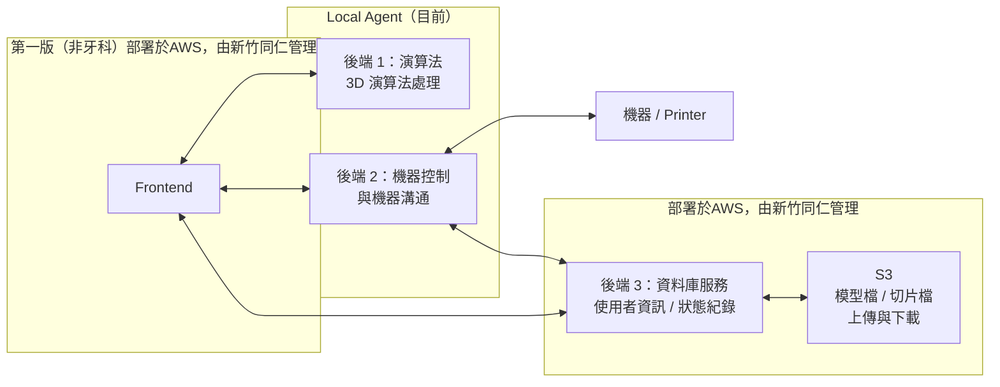

# Research  AWS 整合現況說明

Post: May 21, 2026 9:52 AM
Type: Docs
Progress: ░░░░░░░░░░  0 / 0

# AWS 整合現況說明

---

目前系統由 **Browser 前端、Local Agent、機器 / Printer、雲端資料庫服務** 組成。

### 1. Frontend

使用者透過 Browser 操作前端系統。

目前 **Frontend 第一版（很早期prototype，非牙科）已部署於 AWS**，並由新竹同仁管理。Frontend 負責與使用者互動，並依照功能需求與 Local Agent 或雲端後端服務進行資料交換。

### 2. Local Agent（目前）

目前 Local Agent 內包含兩個主要後端模組：

| 模組 | 職責 |
| --- | --- |
| 後端 1：演算法 | 負責 3D 演算法處理 |
| 後端 2：機器控制 | 負責與機器 / Printer 溝通 |

Local Agent 目前主要負責本機端相關處理，包含演算法運算、機器控制，以及與機器進行雙向溝通。

- 後端 1：演算法
    
    後端 1 負責 3D 演算法處理。
    
    Frontend 會與後端 1 溝通，將使用者操作或模型處理需求交給後端 1 執行。後端 1 完成演算法處理後，再將結果提供給前端或其他系統模組使用。
    
- 後端 2：機器控制
    
    後端 2 負責機器控制與機器溝通。
    
    後端 2 會與機器進行雙向通訊，處理機器狀態、控制指令、列印相關操作等事項。
    
    後端 2 也會與雲端後端 3 交換資料，例如同步使用者資訊、機器狀態或相關紀錄。
    

### 3. 後端 3：資料庫服務

後端 3 屬於雲端服務，負責：

- 使用者資訊
- 帳號管理相關資料
- 狀態紀錄

目前 **後端 3 已部署於 AWS**，並由新竹同仁管理。

Frontend 與 Local Agent 皆可能與後端 3 溝通，以取得或寫入系統所需資料。

### 4. S3：模型檔與切片檔儲存

目前系統另有使用 **AWS S3** 作為檔案儲存服務。

S3 主要負責：

- 模型檔上傳
- 模型檔下載
- 切片檔上傳
- 切片檔下載

S3 會透過後端 3 進行溝通，也就是由後端 3 負責處理檔案存取相關流程。

---

## 目前 AWS 整合範圍整理

| 系統部分 | 目前狀態 | 是否部署 / 使用 AWS | 管理者 | 說明 |
| --- | --- | --- | --- | --- |
| Frontend | 第一版已部署 | 是 | 新竹同仁 | 使用者操作的 Web 前端 |
| 後端 3：資料庫服務 | 已部署 | 是 | 新竹同仁 | 處理使用者資訊、帳號管理與狀態紀錄 |
| S3 檔案儲存 | 已使用 | 是 | 新竹同仁 | 用於模型檔與切片檔上傳 / 下載，透過後端 3 溝通 |
| 後端 1：演算法 | 目前在 Local Agent | 否  | 台北同仁 | 負責 3D 演算法處理 |
| 後端 2：機器控制 | 目前在 Local Agent | 否  | 台北同仁 | 負責與機器 / Printer 溝通 |
| 機器 / Printer | 本機端設備 | 否 | 使用者 / 現場 | 透過後端 2 溝通 |