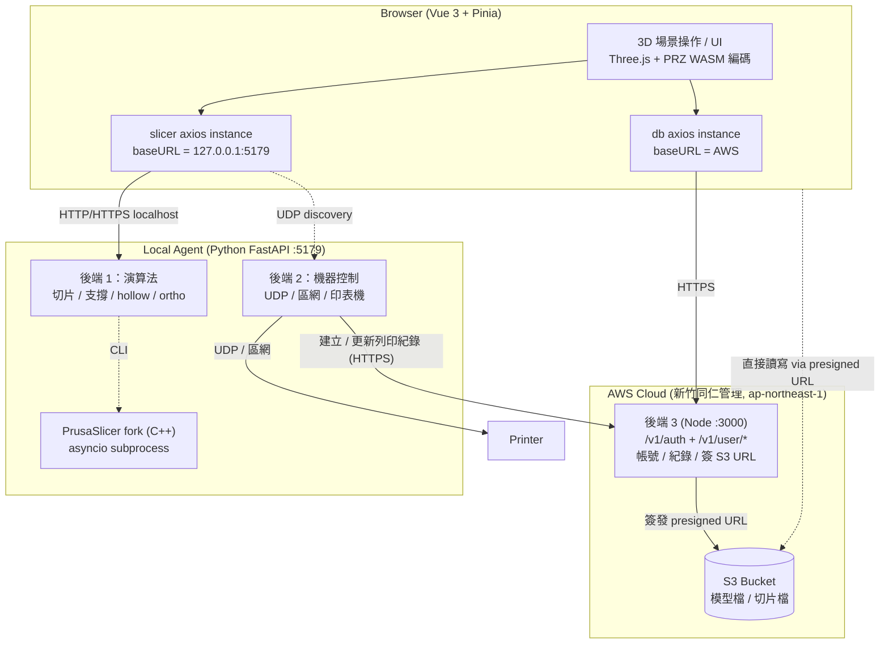
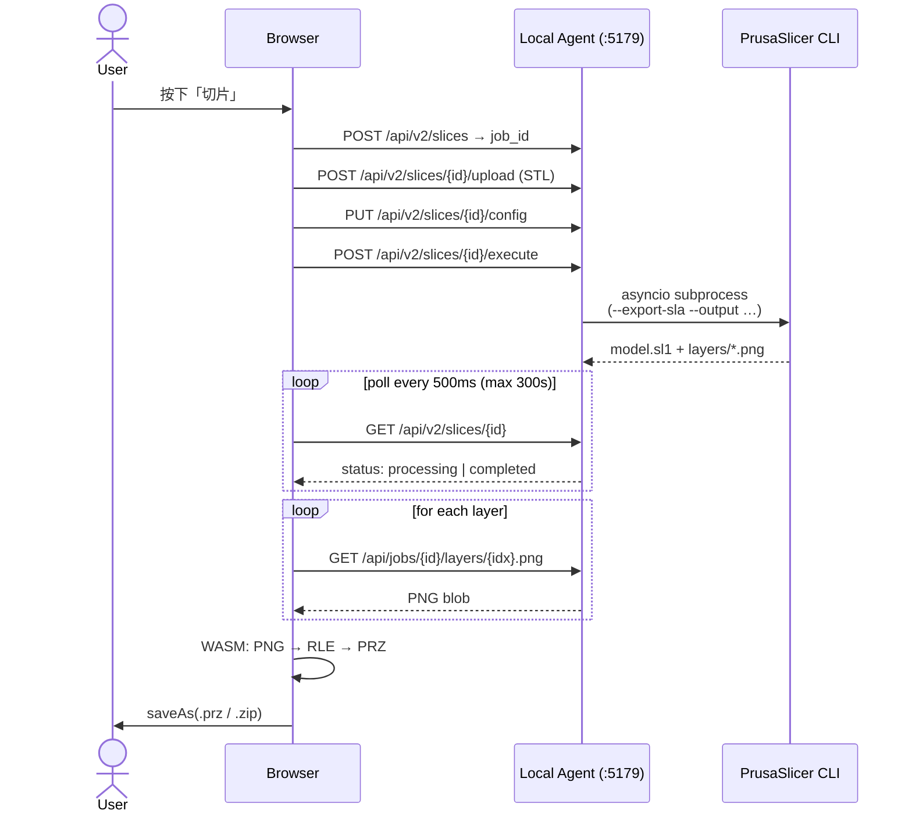
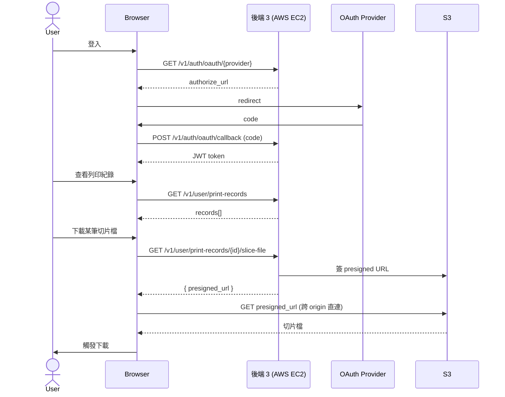
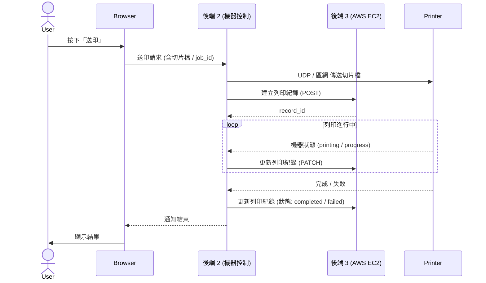
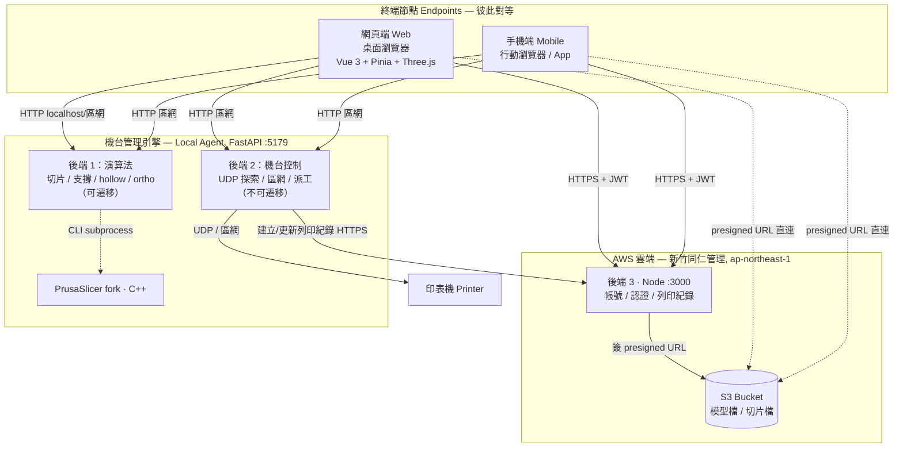

# DS-Online 系統架構概覽

> 本文件為**整體輪廓概覽**，目的是輔助「雲端 vs 本地」架構決策。
> 各模組詳細設計請見既有 docs（文末延伸閱讀）。
>
> 最後更新：2026-05-21

---

## 1. 系統總覽

DS-Online 是 **Browser + Local Agent + AWS Cloud** 的三層架構。**AWS 整合已存在**（由新竹同仁管理），目前負責帳號、紀錄、S3 檔案儲存；**演算法仍 100% 在本機**。



**部署分工**
- **新竹團隊**：AWS Cloud 後端 3 + S3 + 早期 Frontend prototype（非牙科版）
- **台北團隊**：Local Agent（後端 1 + 後端 2）+ 牙科 Frontend

**關鍵特性**
- Frontend 同時是 AWS 與 Local Agent 的 client（兩個 axios instance 明確分離）
- 演算法（重運算）目前**完全在本機**
- 機器控制**必須**在本機（USB / UDP / 區網），無法上雲
- 模型檔與切片檔已走 S3，**用 presigned URL 模式**讓 browser 直接讀寫
- **後端 2 也直接呼叫 AWS 後端 3**（server-to-server）：送印時建立列印紀錄，並隨機器狀態變化更新

---

## 2. 三層職責摘要

### Browser (`/Users/max/repo_claude/DS-Online/`)

| 關注點 | 位置 |
|---|---|
| 入口 | `src/main.js` |
| 兩個 axios instance | `src/axios/axios.js`（`db` → AWS，`slicer` → Local Agent） |
| AWS API client | `src/axios/userService.js`（auth / print records / S3 簽 URL） |
| Local Agent client | `src/axios/backendService.js`（切片 / 上傳 / 支撐） |
| 印表機通訊 | `src/axios/sendPrintService.js`（UDP 走 Local Agent） |
| 切片觸發 | `src/components/features/slicing/SlicerButton.vue` |
| Ortho 自動處理 | `src/services/ortho/orthoAutoProcessingService.js` |
| 主要頁面 | `HomeView`（3D + 工具列）／ `PreviewPage`（預覽 + 下載） |

### Local Agent (`/Users/max/repo_claude/web_slicer_core/`)

| 關注點 | 位置 |
|---|---|
| App 入口 | `agent/main.py`（uvicorn :5179） |
| V2 API（演算法為主） | `agent/api_v2.py`（20+ endpoints） |
| Job 系統 + PrusaSlicer | `agent/jobs.py`（`run_slicing()` 呼叫 subprocess） |
| 通用 CLI 包裝 | `agent/sla_operations.py`（support / hollow / cut 等獨立操作） |
| Ortho 編排 | `agent/ortho_pipeline.py` |

Job 狀態以**磁碟為單一來源**：

```
$JOBS_DIR/{job_id}/
  ├── input/model.stl
  ├── output/model.sl1, model_support.stl, model_hollow.stl, …
  ├── layers/{idx}.png
  └── status.json   ← pending / processing / completed / failed
```

### AWS Cloud（不在本機 repo，由新竹同仁管理）

- 開發環境後端：`http://18.177.174.16:3000`（東京 region，ap-northeast-1）
- 主要路徑：`/v1/auth/*`、`/v1/user/print-records/*`、OAuth callback
- S3 互動模式：**後端 3 簽 presigned URL → Browser 直接讀寫 S3**（避免大檔案經後端 3 代理）

---

## 3. 典型資料流

### 3.1 切片操作（走 Local Agent）



**注意**：Ortho 自動處理為單次操作需 **19 次 HTTP round-trip**（hollow + hex grid + 4× boolean 等），詳見 `runOrthoAutoProcessing_flow.md`。

### 3.2 認證 + 取得列印紀錄檔案（走 AWS）



**注意**：模型檔上傳目前**走 Local Agent**（不走 AWS），但 S3 上的切片檔下載已走 AWS+S3 模式。

### 3.3 送印操作（Local Agent 後端 2 跨呼叫 AWS 後端 3）



**注意**：此流程展示**唯一一條「Local Agent 主動呼叫 AWS」**的路徑。Browser 不再中介，後端 2 直接 server-to-server 寫 AWS。這條既有路徑也意味著 Local Agent 已具備對外 HTTPS 呼叫的能力與認證機制（device token / API key 之類），未來「演算法上雲」的 service-to-service 呼叫可以複用同樣模式。

---

## 4. 與「雲端 vs 本地」決策相關的特性

下表整理現況的隱含假設，以及將**後端 1（演算法）**移到 AWS 的衝擊：

| 特性 | 現況 | 將演算法上 AWS 的衝擊 |
|---|---|---|
| **演算法位置** | Local Agent，subprocess PrusaSlicer | 需在 AWS 跑 PrusaSlicer（容器化 + OpenVDB / Boost / TBB 等依賴） |
| **Job 狀態** | 本機磁碟 `$JOBS_DIR/` | 需 Redis / RDS；中間檔放 S3 |
| **檔案傳輸** | localhost，零成本 | STL upload + PNG download 上 S3，**egress + latency 是新成本** |
| **認證** | 已有 JWT / OAuth（走後端 3） | ✅ 可直接複用 |
| **S3 整合** | 切片檔已用 presigned URL | ✅ 模式已熟，新 service 沿用即可 |
| **CORS / Domain** | localhost + 既有 AWS host | 加一個新 cloud service domain |
| **後端 2（機器控制）** | 必須本機（USB / UDP） | **不能動**，永遠留在 Local Agent |
| **並發** | 一機一次一 job | 雲端需 SQS / Celery queue |
| **Ortho 19 次 round-trip** | localhost < 5ms | 雲端會放大延遲，建議重構為單一 endpoint |
| **離線可用性** | 切片完全可用 | 失去 |

**重點**：AWS infra 已存在（新竹同仁在跑），「演算法上雲」**不是從零開始**，是在既有雲架構上新增一個 compute service。但 Local Agent 不會消失（後端 2 走不掉），所以**不能用「拿掉 local agent 維運成本」當主要動機**。

---

## 5. 多終端架構視圖（階段性成果）

> 本節把第 1–4 節描述的**現況**，改用「**終端 — 雲端 — 機台管理引擎**」三組角色重新整理，並把「多終端」明確納入框架。
> 標記為**階段性成果**：底層架構即為現況，但「機台管理引擎」的命名與「對等多終端」的視角，是為後續演進而確立的，後續可能再調整。

### 5.1 角色重新定位

過去稱為 *Local Agent* 的元件，本節改稱 **機台管理引擎（Machine Management Engine）**。理由：它唯一不可取代的職責是「管理本機區網上的印表機」（USB / UDP / 區網，物理上無法離開本機）；切片演算法只是它**目前**一併承載的功能，而非它的本質定義。命名因此聚焦在永久職責。

整體收斂為三組角色：

- **終端節點（Endpoints）** — 使用者介面所在。可為網頁或手機，**彼此對等**：都只是 client，本身不持久化資料、不跑重運算。
- **AWS 雲端** — 負責**持久、跨裝置、需可信**的狀態：帳號、紀錄、檔案。
- **機台管理引擎** — 負責**短暫、限本機、吃 CPU**的工作：切片演算法 + 機台控制。

### 5.2 架構圖



### 5.3 各節點持有什麼

**終端節點（網頁與手機，對等）**

| 端點 | 載體 | 具備能力 | 不持有 |
|---|---|---|---|
| 網頁端 Web | 桌面瀏覽器（Vue 3 + Pinia） | 3D 場景操作（Three.js）、ortho / 支撐工具、PRZ WASM 編碼、觸發切片、機台派工 | 不持久化任何資料 |
| 手機端 Mobile | 行動瀏覽器 / App | 與網頁端同為雲端與引擎的 client：登入、查紀錄、監控與派工、觸發切片 | 同上；且不自行執行重運算 |

兩者**對等**：同樣透過兩條明確分離的連線運作 ── 一條對雲端（帳號 / 紀錄 / 檔案）、一條對機台管理引擎（切片 / 機台）。差別僅在載體與 UI 形態，不在架構地位。

**機台管理引擎**

| 模組 | 職責 | 遷移性 |
|---|---|---|
| 後端 1：演算法 | 切片 / 支撐 / hollow / ortho；以 asyncio subprocess 呼叫 PrusaSlicer（C++）；job 狀態以本機磁碟為單一來源 | **可遷移** ── 原則上能移到雲端 |
| 後端 2：機台控制 | UDP 區網探索、與印表機通訊、列印任務派送；送印時直接呼叫 AWS 後端 3 建立 / 更新列印紀錄（server-to-server） | **不可遷移** ── 物理上必須在本機 |

對外以單一 FastAPI（:5179）服務。終端在 localhost（同機）或區網（跨機，例如手機）皆可連入。

**AWS 雲端會儲存什麼**

| 類別 | 內容 | 為何必須在雲端 |
|---|---|---|
| 帳號與身份 | 使用者帳號、OAuth 身份、JWT、授權 / 訂閱狀態 | 需跨裝置一致，且為使用者改不到的可信來源 |
| 列印紀錄 | 歷次列印的 metadata 與狀態 | 需持久、可跨裝置查詢 |
| 檔案（S3） | 模型檔、切片檔 | 需持久、可被不同終端與印表機共享存取 |

雲端**不**儲存：切片中間檔與 job 執行狀態 ── 那是機台管理引擎本機磁碟的職責。

### 5.4 溝通方式

| 來源 | 目的 | 協定 / 方式 | 傳輸內容 |
|---|---|---|---|
| 終端（Web / Mobile） | AWS 後端 3 | HTTPS + JWT | 登入、帳號、列印紀錄查詢、要求 S3 presigned URL |
| 終端 | S3 | HTTPS，presigned URL 直連 | 模型檔 / 切片檔的實際讀寫（不經後端 3 代理） |
| 終端 | 引擎 後端 1 | HTTP（localhost 或區網） | STL 上傳、切片 config、執行切片、輪詢狀態、取切片結果 |
| 終端 | 引擎 後端 2 | HTTP + UDP 探索（區網） | 印表機探索、送印、機台狀態查詢 |
| 引擎 後端 2 | AWS 後端 3 | HTTPS（server-to-server，device token / API key） | 送印時建立列印紀錄、隨機台狀態更新 |
| AWS 後端 3 | S3 | AWS SDK | 簽發 presigned URL |
| 引擎 後端 1 | PrusaSlicer | CLI · asyncio subprocess | 切片參數 + STL 路徑 → .sl1 + layers PNG |
| 引擎 後端 2 | 印表機 | UDP / 區網 | 列印任務派送、狀態回報 |

**連線位置差異**：網頁端通常與引擎在同一台機器，走 `localhost`；手機端則跨機器，走區網 IP。兩者連的是同一個引擎，差別只在 host 位址 ── 這正是「引擎不必與 UI 同裝置」的具體體現。

---

## 6. 延伸閱讀（既有 docs）

| 文件 | 涵蓋 |
|---|---|
| `Research-AWS-integrations.md` | 同事整理的「目前 AWS 整合範圍」全貌（含三後端職責、新竹/台北分工） |
| `backend_API.md` | Local Agent V1 / V2 完整 endpoint 規格 |
| `backend_integration_plan.md` | 前後端整合決策（mode、job 管理、async polling、錯誤處理） |
| `slicing_flow.md` | 切片從按鈕到 preview 的完整時序與延遲下載策略 |
| `support_generation_architecture.md` | 支撐產生的分層設計 |
| `runOrthoAutoProcessing_flow.md` | Ortho 5 步驟 19 次 HTTP 的詳細呼叫序列 |
| `slicing_performance_analysis.md` | 切片效能分析（benchmark baseline） |
| `phrozengo_cloud_architecture.md` | PhrozenGo 遠端列印整合評估（與本次「演算法上雲」研究**無關**） |
| `undo_redo_architecture.md` | Undo/Redo 框架設計 |
| `plan_lazy_layer_loading.md` | 層延遲載入計畫 |

---

## 7. 一句話結論

> DS-Online 是**三層架構**：Browser、Local Agent（演算法 + 機器控制）、AWS Cloud（帳號 + S3）。AWS 整合已完成「帳號、紀錄、檔案儲存」三件事；**演算法仍 100% 在本機**。研究「演算法是否上雲」時，infra 起點不是零（可複用既有 AWS 與 S3 模式），但**機器控制永遠走不掉**，所以 Local Agent 不會消失。
