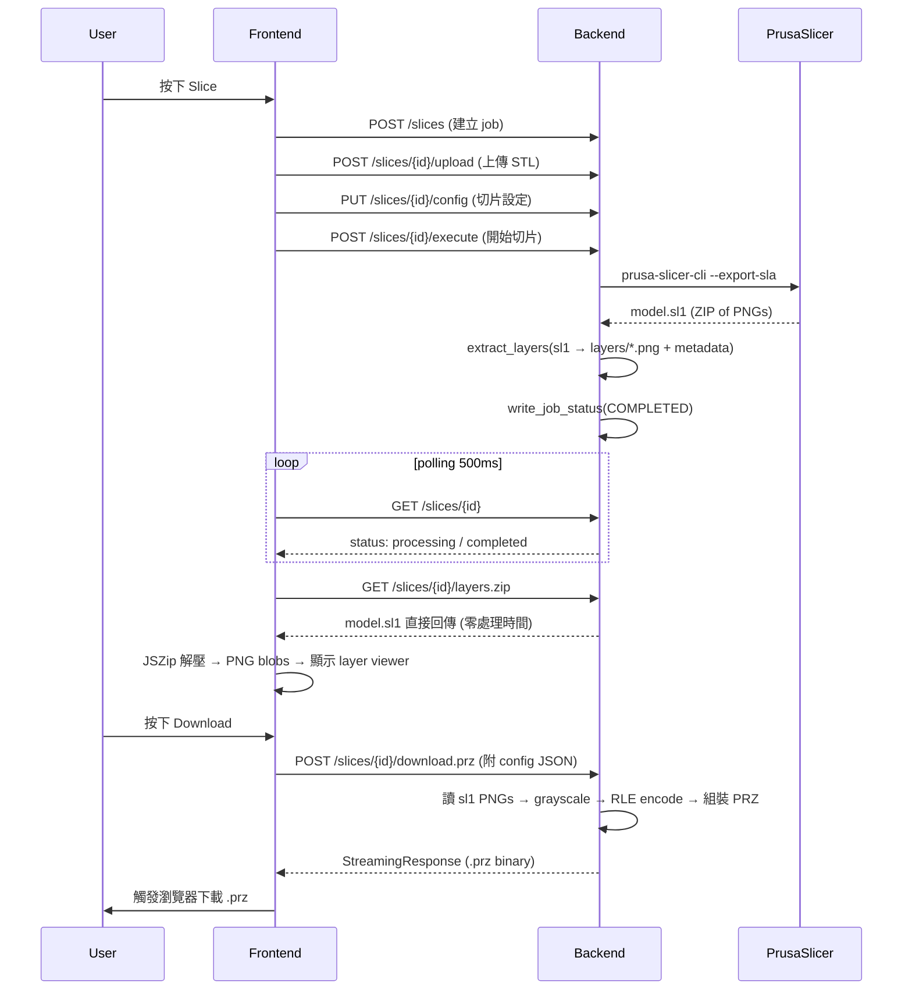
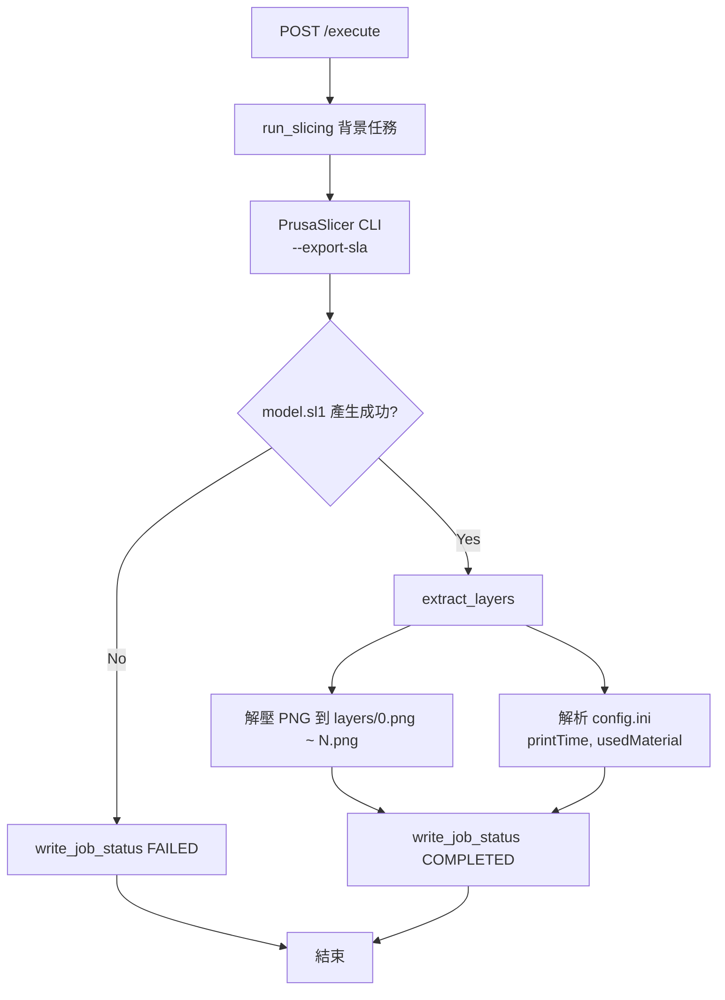
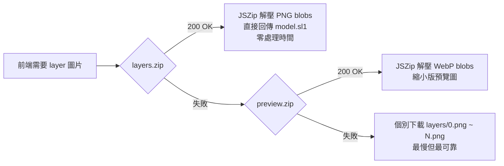
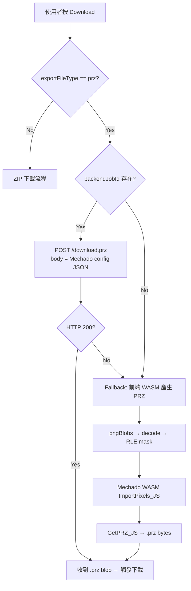
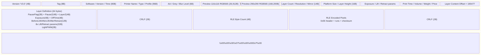
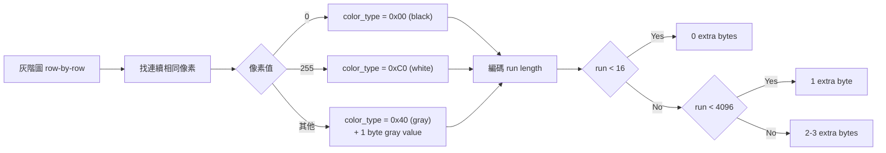
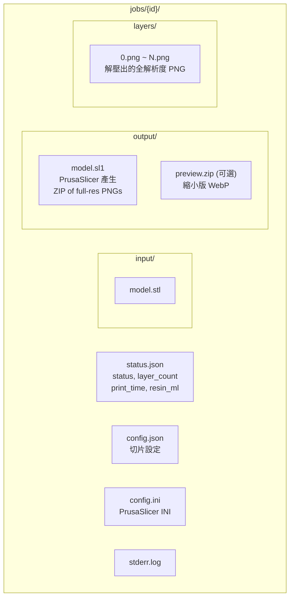

# Backend PRZ Pipeline Architecture

本文件描述後端切片 + PRZ 產生的完整流程與檔案結構。

## 1. 整體流程總覽

## 2. 切片階段詳細流程

## 3. 圖層預覽下載 — Fallback Chain

## 4. PRZ 下載流程

## 5. PRZ 二進位格式結構

## 6. RLE 編碼格式

## 7. Job 檔案結構

## 8. Backend API 端點

| Method | Path | 說明 |
|--------|------|------|
| POST | `/api/v2/slices` | 建立 job |
| POST | `/api/v2/slices/{id}/upload` | 上傳 STL |
| PUT | `/api/v2/slices/{id}/config` | 設定切片參數 |
| POST | `/api/v2/slices/{id}/execute` | 開始切片 |
| GET | `/api/v2/slices/{id}` | 查詢 job 狀態 |
| GET | `/api/v2/slices/{id}/uchars` | 取得層數資訊 |
| GET | `/api/v2/slices/{id}/layers.zip` | 下載層圖 ZIP (直接回傳 .sl1) |
| GET | `/api/v2/slices/{id}/preview.zip` | 下載縮小版 WebP 預覽 |
| POST | `/api/v2/slices/{id}/download.prz` | 產生並下載 PRZ 檔 |
| GET | `/api/v2/slices/{id}/gcode` | 取得 G-code metadata |
| GET | `/api/jobs/{id}/layers/{idx}.png` | 取得單層 PNG (fallback) |

## 9. 關鍵設計決策

1. **layers.zip 直接回傳 .sl1**：.sl1 本身就是 PNG 的 ZIP，每張 PNG 約 4.5KB（SLA 切片圖壓縮率極高），595 層只有 2.7MB。零伺服器處理時間。

2. **PRZ 在 download 時才產生**：PRZ 依賴使用者設定（曝光、抬升速度等），無法預先產生。但 RLE 編碼的圖片資料與設定無關。

3. **preview.zip 為 fallback**：需要 PIL resize + WebP encode，595 層需 ~12 秒。僅在 layers.zip 不可用時使用。

4. **Frontend fallback chain**：layers.zip → preview.zip → 個別 PNG，確保任何環境都能顯示預覽。

5. **PRZ download fallback**：後端 download.prz → 前端 WASM (Mechado)，確保離線也能產生 PRZ。
