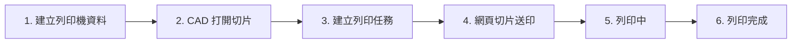
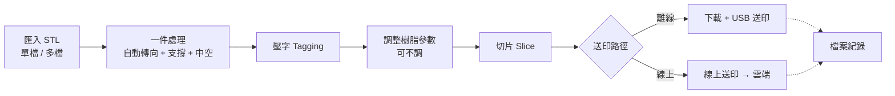

# 完整使用流程 End-to-End User Workflow

> **來源**:使用者於 2026-06 提供的流程圖,經 Claude 整理為文字規格。
> **用途**:供 Claude Code 參考實作,亦可作為 PM / 工程 / Demo 對齊的單一文件。
> **狀態**:多段標註「待釐清 / 處理中 / 研究中」,實作前請逐項確認。

---

## 0. 概覽

PhrozenStudio Dental 的完整 user journey 分六階段,對應原始流程圖由左至右六個欄位:

1. **建立列印機資料**(printer setup)
2. **從牙科設計軟體打開切片**(CAD → slicer launch)
3. **建立列印任務資料**(job context)
4. **網頁切片送印**(slice + dispatch,核心)
5. **列印中監控**(in-flight monitoring)
6. **列印完成 + 紀錄保留**(completion + retention)

### 高階流程圖

### 階段 4 內部流程

---

## 1. 階段一 · 建立列印機資料

**目的**:讓 Web Slicer / 機台管理引擎知道區網上有哪些印表機可派工。

### 1.1 單機情境
- 使用者**手動輸入機器 IP**。
- 一台印表機一筆紀錄。

### 1.2 多機 / 無法取得 IP / Safari 情境
- 使用者**下載 UDP 探索工具**(獨立 binary 或本機 agent)。
- 工具自動偵測區網上的 Phrozen 印表機,並回填到 Web Slicer。
- 涵蓋:多台、未知 IP、瀏覽器(Safari)無法做 LAN 探索的情況。

> **實作筆記**:這條 UDP 工具對應 `docs/architecture.md` 第 5 節定義的「機台管理引擎 · 後端 2 機台控制」。Web Slicer 透過它在區網上發現印表機。

---

## 2. 階段二 · 從牙科設計軟體打開切片

**前提**:Web Slicer 已與 CAD(3Shape / exocad / uLab 等)做過串接。

### 流程
1. 使用者在 CAD 內完成設計(排牙、植體規劃、咬合板設計等)。
2. 在 CAD 內**點一個按鈕**(plugin / integration)。
3. 系統自動:
   - 開啟瀏覽器(default browser)。
   - 載入 Web Slicer 並**自動上傳剛才設計的模型**。

> ⛔ **處理中**:跟設計軟體的串接(原圖黃便利貼)。
>
> 實作前需先確認:
> - 第一波要串接哪幾家 CAD(優先順序)?
> - 各家 CAD 的 plugin / hook 機制(STL 匯出?直接 POST?protocol handler?)。
> - Web Slicer 端要提供的 receive endpoint(走帳號驗證、走 device token、或匿名)?

---

## 3. 階段三 · 建立列印任務資料

**目的**:把這次列印的 context(誰、用哪台機、用哪種樹脂)綁定到 job。

### 流程
1. **登入帳號**(若未登入)。登入後可看到:
   - 已綁定的機台(階段 1 加入的)。
   - 歷史列印紀錄。
   - 自定義樹脂參數預設值。
2. 選擇本次列印的:
   - **機台 Machine**
   - **模型檔 Model**(階段 2 自動帶入,或這裡手動選)
   - **樹脂 Resin**(選樹脂時自動帶入對應的列印參數與模式)

> 對應 demo 簡報 `p12 Workflow` 的 step 2「選樹脂 Resin → Mode」。

---

## 4. 階段四 · 網頁切片送印(核心)

進入 Web Slicer 切片介面後,完成從**匯入 → 送印**的一條龍流程。

### 4.1 匯入 Import

兩種入口,UI 上需明確區分:

| 入口 | 行為 | 後續處理 |
|---|---|---|
| 匯入單個 STL | 直接放到工作平台 | 對該檔做一件處理 |
| 匯入多個 STL | 全部放到工作平台 | 可分別處理,或批次一件處理所有 |

每個匯入步驟都有「**下載專案檔**」選項,讓使用者可以中途存檔。

### 4.2 一件處理 One-click Processing

**自動三合一**(每個 STL 都會被處理一次):

- **自動轉向 Auto-Orient** ── 選最佳列印方向。
- **自動長支撐 Auto Support** ── 加列印支撐。
- **自動蜂窩巢結構 Auto Hex Infill** ── 中空 + 蜂巢填充 + 排水孔(視模式與適應症)。

兩種觸發路徑:
- **單檔**:一件處理該檔。
- **多檔批次**:一次對所選的多個檔執行一件處理。

每階段都應該可下載專案檔。

> 對應 demo 簡報 `p10 Per-Mode Processing`:四個模式各自的支撐禁區、壓字策略由模式決定。

### 4.3 壓字 Tagging

- 使用者**輸入文字**(患者 ID、階段序號、牙位 FDI、左右側等)。
- **選擇位置**(底座、外側非就位面等,因模式而異)。
- 對應 v0.6 簡報 `p10` 各模式的「壓字 Tagging」差異化。

> ⛔ **確認**:原圖上下兩條分支都標「Web Slicer 5」,一條寫「單字」、一條寫「坐字」── 兩條都是同一個「壓字」功能,只是 typo。實作統一稱「**壓字 Tagging**」。

### 4.4 調整樹脂參數 Resin Parameter Tuning

- **可不調**(預設用驗證過的樹脂檔,多數情況不需要動)。
- 進階使用者可手動修改 47+ 參數(曝光、運動、進階、機台 GCode 四類)。
- 對應 demo 簡報 `p13 Print Parameters`。

### 4.5 切片 Slice

- 整批一次切片(若有多檔)。
- UI 應有進度條與完成提示。

### 4.6 送印 Dispatch

**兩種送印路徑**:

| 路徑 | 適用情境 | 流程 |
|---|---|---|
| **下載 + USB 送印** | 離線、單機、不上雲 | Web Slicer 下載切片檔 → 使用者拷到 USB → 插印表機 → 印表機 UI 選檔列印 |
| **線上送印** | 連雲、有帳號 | Web Slicer 直接把切片檔傳到雲端 → 雲端推給機台或機台拉取 → 開始列印 |

**兩條都會留檔案紀錄**(送印紀錄上雲)。

> ⛔ **待確認**:
> - 兩種路徑是否對應 Standard / Plus 分級?還是兩個方案都可用?
> - 線上送印的傳輸:是雲端中介(機台連雲),還是經 Local Agent server-to-server?
> - 若機台目前還沒連雲(目前機種大多如此),「線上送印」是否其實也走 Local Agent 中繼?

---

## 5. 階段五 · 列印中監控

**兩種監控介面並存**,使用者可選:

### 5.1 Web Slicer(瀏覽器內)
- 機器狀態(idle / printing / paused / error / completed)
- 列印中的**檔名**
- **層數進度**(目前印到第幾層 / 總層數)
- 控制:**暫停列印**、**終止列印**

### 5.2 PhrozenGo APP(手機 App)
- **即時串流畫面**(機台內建鏡頭)
- 列印檔名、速度 / 步數、時間、層數進度
- 控制:**終止列印**

> **實作筆記**:兩個介面需訂閱同一份狀態源(機台 → 雲端的列印狀態 stream),保證一致。實作時建議定義一份 `PrintJobStatus` schema,兩端 client 共用。

---

## 6. 階段六 · 列印完成 + 紀錄保留

### 6.1 紀錄保留規則

| 檔案類別 | 自動保留期 |
|---|---|
| **模型檔(STL / 設計檔)** | 列印完成後 **3 天**自動刪除 |
| **切片檔(PRZ / SL1)** | 列印完成後 **7 天**自動刪除 |

### 6.2 列印狀態紀錄
- 紀錄**是否完成列印**(completed / failed / aborted)。
- 列印 metadata(時間、機台、樹脂、模式、層數、用時)留存,**不受 3/7 天規則影響**(供日後查詢與大數據分析)。

> ⛔ **待確認**:
> - 3 天 / 7 天的保留期限是固定的,還是依方案(Standard / Plus)不同?
> - 使用者能否手動延長保留期或標記「重要」鎖定?

---

## 待釐清 / 待設計(Open Items)

實作前需先解決的開放項目,依優先順序排:

### A · 處理中(In Progress)

1. **CAD 串接**(階段 2 整段) ── 整個 user flow 的進入點;優先順序最高。
   - 第一波串接哪幾家?
   - 用什麼機制(plugin / protocol handler / shared folder watch)?
   - Web Slicer 端的 receive endpoint 與認證流程。

### B · 研究中(Under Research)

2. **列印大數據** ── 雲端應該存什麼?
   - 候選資料:列印 metadata、失敗原因、樹脂用量、後處理結果。
   - 與隱私 / 合規(HIPAA / GDPR / PMDA)的權衡。
   - 是否提供使用者 opt-out 機制。

### C · 待確認(Decisions Needed)

3. 「坐字」是「壓字」typo,實作統一稱「**壓字 Tagging**」。
4. **離線 USB vs 線上送印** 與 Standard / Plus 方案的對應關係。
5. **線上送印的實際路徑**:走機台連雲、走 Local Agent server-to-server、或兩種並存?
6. **紀錄保留期(3/7 天)**:是否依方案調整?是否提供手動延長?

---

## 對應 Demo 簡報

本流程對應 PhrozenStudio Dental 客戶 demo 簡報(`docs/demo/PhrozenStudio Dental - 牙科切片解決方案 v0.6.pptx`)的下列頁面:

| 流程階段 | 對應簡報頁 |
|---|---|
| 階段 4(整段) | **p12 Workflow** ── 簡化為 8 步水平流程圖 |
| 階段 4.2 一件處理 | **p10 Per-Mode Processing** ── 四模式的處理動作與禁區 |
| 階段 4.4 調整樹脂參數 | **p13 Print Parameters** ── 47+ 參數四大類別 |
| 階段 5.1 / 5.2 | (尚未明確進入簡報) |
| 階段 6.1 紀錄保留 | (尚未明確進入簡報) |

> 若 demo 時想完整展示這條 user journey,可在 `p13` 與 `p14` 之間插入一頁「**Full User Journey 完整使用流程**」(直接用本文件的兩張 mermaid 圖)。

---

## 給實作者(Claude Code)的提醒

1. **狀態源唯一化**:階段 5 兩個監控介面(Web Slicer、PhrozenGo APP)必須訂閱**同一份**狀態 stream(機台 → 雲端 → client),避免雙界面狀態不一致。建議先定義 `PrintJobStatus` schema。

2. **中間存檔點**:階段 4 每個處理動作(轉向、支撐、中空、壓字)都應有「**可下載專案檔**」的機制,讓使用者中斷後可恢復;不要把流程做成「不可中斷的長 transaction」。

3. **機台管理引擎是底層**:階段 1 的 UDP 探索與階段 5 的列印控制,都歸**機台管理引擎(後端 2)**負責 ── 對應 `docs/architecture.md` 第 5 節。

4. **演算法位置**:階段 4 的切片運算屬**後端 1 演算法**;若未來搬到雲端,需保留 4.6 的**離線(USB)送印**作為 fallback,因為機台尚未全面連雲。

5. **離線可用性**:由於送印有離線路徑(USB),整個階段 4 應保證**就算沒有網路也能完成切片並產出檔案**;線上送印才需要網路。

6. **帳號是入口**:階段 3 「登入帳號」是整個 user journey 的綁定點,後續所有 metadata、紀錄、權限都跟帳號綁。實作 CAD 串接(階段 2)時,要想清楚未登入的使用者跳哪裡(導去登入頁?匿名先用後綁?)。

---

## 變更紀錄

| 日期 | 版本 | 變更 |
|---|---|---|
| 2026-06 | v0.1 | 初版,從原始流程圖整理。 |
