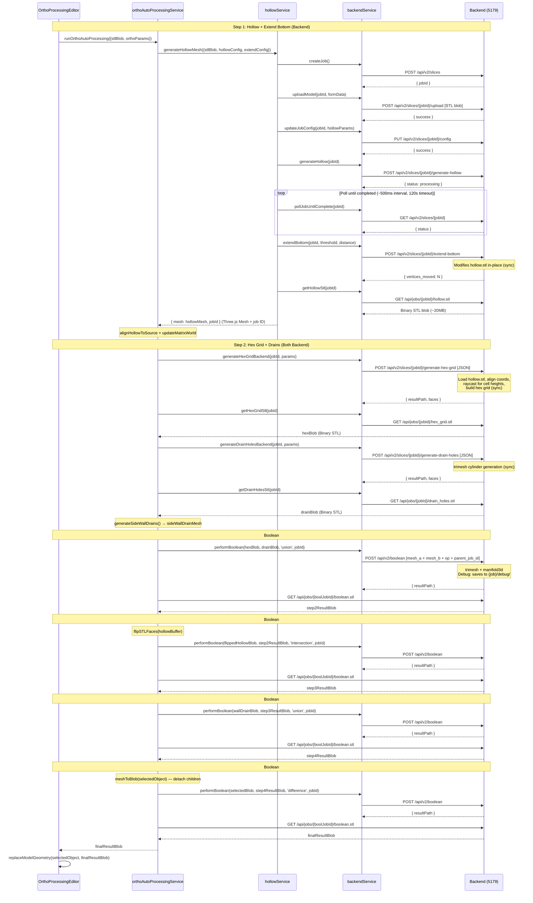

# `runOrthoAutoProcessing` 詳細流程（zh_TW）

本文說明 `src/services/ortho/orthoAutoProcessingService.js` 中 `runOrthoAutoProcessing()` 的完整執行流程、API 呼叫、資料流與錯誤處理。

## 1. 函式定位與目的

- 入口函式：`src/services/ortho/orthoAutoProcessingService.js:178`
- 目的：執行齒科正畸模型自動處理流程，管線順序為：
  1. Hollow（中空化）+ Extend Bottom（底部延伸，後端 API）
  2. Hex infill（蜂巢內填，後端 API）+ drain holes（底部排液孔，後端 API）
  3. 與反向 hollow 做 intersection
  4. 加上 side wall drains（側壁排液孔）
  5. 與原始外殼做 difference，得到最終 STL

## 2. 輸入與回傳

### 2.1 輸入參數

`runOrthoAutoProcessing({ ... })` 接受：

- `selectedObject`: Three.js `Object3D`，目前選取模型（外殼）
- `stlBlob`: 原始模型 STL（`Blob`）
- `modelId`: 模型 UUID
- `orthoParams`: 正畸流程參數（中空、延伸、蜂巢、排液）
- `debug`（預設 `false`）: 是否輸出每步 debug STL
- `onProgress(step, message)`：進度 callback
- `onPreviewMeshes(meshes)`：預覽 mesh callback

### 2.2 回傳

- 成功：`Promise<Blob>`，最終處理後 STL。
- 失敗：拋出 `OrthoProcessingError`（或包裝後的 `OrthoProcessingError`）。

## 3. API 呼叫與資料流序列圖



## 4. API 呼叫一覽

| Step | Endpoint | Method | 傳輸資料 |
|------|----------|--------|----------|
| 1a | `/api/v2/slices` | POST | JSON → jobId |
| 1b | `/api/v2/slices/{id}/upload` | POST | STL blob (multipart) |
| 1c | `/api/v2/slices/{id}/config` | PUT | JSON hollow params |
| 1d | `/api/v2/slices/{id}/generate-hollow` | POST | 觸發 PrusaSlicer (async) |
| 1e | `/api/v2/slices/{id}` | GET | Poll status (×N) |
| 1f | `/api/v2/slices/{id}/extend-bottom` | POST | JSON {threshold, distance} → sync |
| 1g | `/api/jobs/{id}/hollow.stl` | GET | ← STL blob (~20MB) |
| 2a | `/api/v2/slices/{id}/generate-hex-grid` | POST | JSON params → sync generation |
| 2b | `/api/jobs/{id}/hex_grid.stl` | GET | ← STL blob (hex grid) |
| 2c | `/api/v2/slices/{id}/generate-drain-holes` | POST | JSON params → sync generation |
| 2d | `/api/jobs/{id}/drain_holes.stl` | GET | ← STL blob (drain cylinders) |
| 3-5 | `/api/v2/boolean` (×4) | POST | 2× STL blobs + parent_job_id (multipart) → resultPath |
| 3-5 | `/api/jobs/{id}/boolean.stl` (×4) | GET | ← STL blob result |

**總計約 19 次 HTTP 請求**（不含 polling）

## 5. 前置工具與子流程

### 5.1 Boolean 執行與等待

`runBoolean(blobA, blobB, operation, parentJobId)`：

1. 呼叫 `performBoolean(mesh_a, mesh_b, operation, parentJobId)`（`src/axios/backendService.js`）
2. 優先解析 `resultPath`（支援 `payload.data` 或 root 層的 `resultPath` / `result_path`）
3. 若有 `resultPath`，輪詢下載該路徑（`waitForBooleanStlAtPath`）
4. 否則解析 `jobId`，再輪詢 `getBooleanStl(jobId)`
5. 輪詢條件：間隔 500ms，timeout 120000ms，400/404 視為尚未就緒
6. 當傳入 `parentJobId` 時，後端會自動將每步 boolean 的輸入/輸出 STL 存至 `{job}/debug/`
7. `/api/v2/slices/{jobId}` 只用於 slice job status polling，不可用來等待或下載 boolean 結果

### 5.2 STL 幾何工具

- `meshToBlob(mesh)`: 先 `updateMatrixWorld(true)`，再用 `STLExporter` 匯出 binary STL blob
- `flipSTLFaces(binaryData)`: 逐三角形反轉 normal，並交換第 2/3 頂點順序（用於翻面）

### 5.3 主要依賴模組

- `generateHollowMesh()` / `alignHollowToSource()`：`src/services/ortho/hollowService.js`
  - 內含 `extendBottom()` 呼叫後端 API（取代舊有的 client-side `extendBottomVertices`）
  - 回傳 `{ mesh, jobId }`，`jobId` 供後續 hex grid / drain holes 等後端操作重用
- `generateHexGridBackend()` / `getHexGridStl()`：`src/axios/backendService.js`（後端 API）
- `generateDrainHolesBackend()` / `getDrainHolesStl()`：`src/axios/backendService.js`（後端 API）
- `generateSideWallDrains()`：`src/services/ortho/drillService.js`（前端）

### 5.4 純前端處理（無 API 呼叫）

- `generateSideWallDrains()` — 2D 橫截面 + ray-casting
- `flipSTLFaces()` — binary STL 法線翻轉
- `meshToBlob()` — Three.js → STL 匯出（暫時移除 children 避免匯出 back-face mesh）

### 5.5 後端座標對齊

PrusaSlicer 在中空化時會將模型的 bounding box 中心移到原點。因此後端在 hex grid 生成時，會將 hollow mesh 平移回原始模型座標空間：

```python
input_center = (input_mesh.bounds[0] + input_mesh.bounds[1]) / 2
hollow_mesh.apply_translation(input_center)
```

### 5.6 Debug 匯出（後端）

當 `parentJobId` 傳入 boolean 端點時，後端會自動將所有中間檔案存至 `{job_dir}/debug/`：

```
jobs/{jobId}/debug/
  input_model_outer.stl        # 原始輸入模型
  hollow_for_raycasting.stl    # 對齊後的 hollow mesh
  step1_union_inputA.stl       # Boolean #1 輸入 A (hex grid)
  step1_union_inputB.stl       # Boolean #1 輸入 B (drain holes)
  step1_union_output.stl       # Boolean #1 輸出
  step2_intersection_inputA.stl
  step2_intersection_inputB.stl
  step2_intersection_output.stl
  step3_union_inputA.stl
  step3_union_inputB.stl
  step3_union_output.stl
  step4_difference_inputA.stl
  step4_difference_inputB.stl
  step4_difference_output.stl
```

## 6. 主流程（Step-by-step）

### Step 1：Backend Hollow + 底部延伸

1. `onProgress(1, 'Generating hollow mesh...')`
2. 呼叫 `generateHollowMesh({ stlBlob, modelId, hollowConfig, extendConfig })`，回傳 `{ mesh, jobId }`，內部流程：
   - `createJob()` → `uploadModel()` → `updateJobConfig()` → `generateHollow()`
   - `pollJobUntilComplete(jobId, timeout=120000)`
   - `extendBottom(jobId, threshold, distance)` — 後端同步修改 hollow.stl
   - `getHollowStl(jobId)` 下載已延伸的中空 STL
   - `STLLoader.parse()` 轉成 Three Mesh
   - 回傳 `{ mesh, jobId }` — `jobId` 供 Step 2 重用
3. `alignHollowToSource(hollowMesh, selectedObject)` 對齊位置/旋轉/縮放
4. `onPreviewMeshes({ hollow })`
5. 若 `debug=true`，輸出 `step1_extendedHollow`

### Step 2：建立 Hex / Drain，先做 Union

1. `onProgress(2, 'Generating infill and drain meshes...')`
2. 呼叫 `generateHexGridBackend(jobId, params)` — 後端 raycast hollow mesh 自適應 cell 高度
   - 後端載入 hollow.stl，平移至原始模型座標空間
   - 使用 trimesh 做批次 raycast，決定每個 hex cell 的高度
   - 產生 hex grid mesh 並儲存為 `model_hex_grid.stl`
   - 同時建立 `{job}/debug/` 並匯出對齊後的 hollow mesh 與輸入模型
3. 呼叫 `getHexGridStl(jobId)` 下載 hex grid STL blob
4. 呼叫 `generateDrainHolesBackend(jobId, params)` — 後端 trimesh 產生 drain cylinders（重用 Step 1 的 `jobId`）
5. 呼叫 `getDrainHolesStl(jobId)` 下載 drain STL blob
6. 建立 `sideWallDrainMesh = generateSideWallDrains(...)` — 側壁排液孔（前端，留待 Step 4）
7. 若 `hexGridResult` 無 faces，拋 `OrthoProcessingError`
8. 若有 `drainBlob`：`step2ResultBlob = runBoolean(hexBlob, drainBlob, 'union', jobId)`
9. 否則：`step2ResultBlob = hexBlob`

### Step 3：翻面 Hollow 後做 Intersection

1. `onProgress(3, 'Computing intersection with hollow...')`
2. 匯出 hollow 為 binary STL → `flipSTLFaces()` 反轉法線
3. `step3ResultBlob = runBoolean(flippedHollowBlob, step2ResultBlob, 'intersection', jobId)`

### Step 4：加入側壁排液孔（Union）

1. `onProgress(4, 'Adding side wall drains...')`
2. 若存在 `sideWallDrainMesh`：`step4ResultBlob = runBoolean(wallDrainBlob, step3ResultBlob, 'union', jobId)`
3. 否則：`step4ResultBlob = step3ResultBlob`

### Step 5：與外殼做最終 Difference

1. `onProgress(5, 'Computing final difference...')`
2. 匯出 `selectedObject`（暫時移除 children 以避免 back-face mesh 重複匯出）
3. `finalResultBlob = runBoolean(selectedBlob, step4ResultBlob, 'difference', jobId)`
4. `onProgress(6, 'Complete')`
5. `return finalResultBlob`

## 7. 進度回報對應

| Step | 訊息 |
|------|------|
| 1 | `Generating hollow mesh...` |
| 2 | `Generating infill and drain meshes...` |
| 3 | `Computing intersection with hollow...` |
| 4 | `Adding side wall drains...` |
| 5 | `Computing final difference...` |
| 6 | `Complete` |

## 8. 參數清單（`orthoParams`）

預設值來源：`src/stores/useBackendStore.js`

| 參數 | 預設值 | 用途 |
|------|--------|------|
| `hollowing_min_thickness` | 3.0 | 中空最小厚度 (mm) |
| `hollowing_quality` | 0.5 | 中空品質 |
| `hollowing_closing_distance` | 2.0 | 中空 closing distance (mm) |
| `extension_distance` | 10.0 | 底部延伸距離 (mm) |
| `bottom_z_threshold` | 0.5 | 底部頂點選取閾值 (mm) |
| `hex_cell_radius` | 5.0 | 蜂巢半徑 (mm) |
| `hex_wall_thickness` | 1.0 | 蜂巢壁厚 (mm) |
| `hex_pyramid_height` | 3.0 | 蜂巢錐體高 (mm) |
| `hex_grid_count` | 10 | 蜂巢格數 |
| `drain_hole_radius` | 1.5 | 排液孔半徑 (mm) |

## 9. 例外與失敗路徑

1. Hex grid 建立失敗（0 faces）→ 拋 `OrthoProcessingError`
2. Boolean 回傳同時缺少 `resultPath/jobId` → 拋 `OrthoProcessingError`
3. 其他例外在最外層 `catch` 被包成 `OrthoProcessingError`

## 10. 呼叫端整合重點

在 `OrthoProcessingEditor.vue` 通常流程為：

1. 取得 `selectedObject`
2. 匯出 `stlBlob`（`exportSTL` — 含 children，用於 Step 1 上傳）
3. 呼叫 `runOrthoAutoProcessing(...)`
4. 用 `replaceModelGeometry(selectedObject, finalResultBlob)` 替換模型幾何

注意：Step 5 匯出 `selectedObject` 時會暫時移除 children，只匯出 front-face mesh 的 geometry，避免 back-face child mesh 造成重複面數導致 boolean 失敗。
