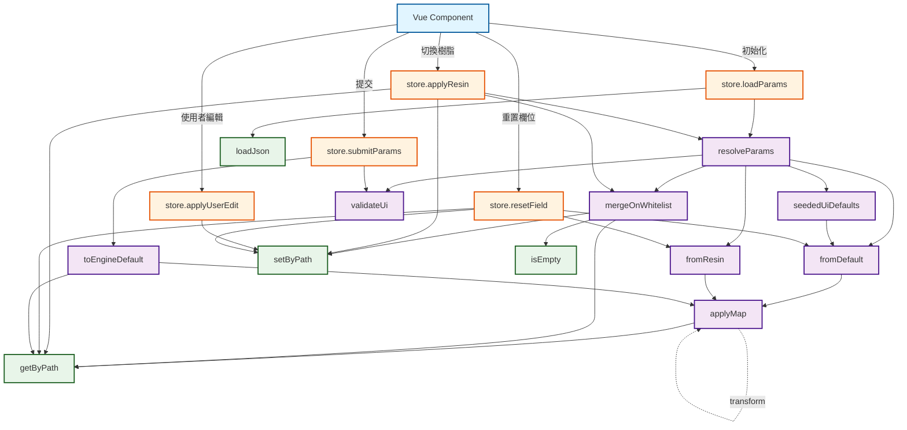
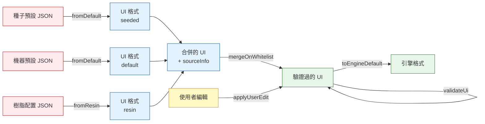

# 配置參數系統架構文檔

本文檔說明配置參數系統的各個模組及其函數的功能，以及它們之間的交互作用。

## 系統概述

配置參數系統負責處理 3D 列印機的配置參數，包括：
- 從不同來源（機器預設、樹脂配置檔）載入參數
- 將參數轉換為統一的 UI 格式
- 合併多層參數並追蹤來源
- 驗證參數有效性
- 將 UI 格式轉換回引擎格式

## 模組說明

### 1. adapters.js

此模組負責在不同資料格式之間進行轉換。

#### 函數說明

##### `applyMap(source, map)`
**功能：** 將來源物件根據映射表進行轉換
- **參數：**
  - `source`: 來源資料物件
  - `map`: 映射規則陣列，每個項目包含 `from`, `to`, `transform`
- **回傳：** 轉換後的物件
- **處理邏輯：**
  1. 根據 `item.from` 從來源提取值
  2. 如果有 `transform` 函數則套用轉換
  3. 跳過空值 (undefined/null/'')
  4. 根據 `item.to` 設定到輸出物件的深層路徑

##### `fromDefault(defaultJson)`
**功能：** 將機器預設 JSON 轉換為 UI 格式
- **參數：** `defaultJson` - 機器預設配置檔案
- **回傳：** UI 格式的參數物件
- **實作：** 使用 `applyMap` 配合 `defaultToUi` 映射表

##### `fromResin(resinJson)`
**功能：** 將樹脂配置 JSON 轉換為 UI 格式
- **參數：** `resinJson` - 樹脂配置檔案
- **回傳：** UI 格式的參數物件
- **實作：** 使用 `applyMap` 配合 `resinToUi` 映射表

##### `seededUiDefaults` (IIFE)
**功能：** 建立種子 UI 預設值
- **特性：** 立即執行函數表達式 (IIFE)，在模組載入時執行一次
- **處理邏輯：**
  1. 從 `sonic_4k_2022.json` 載入種子預設檔案
  2. 使用 `fromDefault()` 轉換為 UI 格式
  3. 建立結構化的預設物件，包含：
     - `schemaVersion`: 版本號
     - `machine`: 機器資訊 (名稱、類型、解析度、Z 高度、床尺寸、邊距)
     - `print`: 列印參數 (層高、曝光時間、底層設定、延遲時間等)
     - `motion`: 運動參數 (底層和正常層的提升/回縮速度和距離)
     - `gcode`: G-code 設定
     - `advanced`: 進階設定
- **用途：** 作為參數合併的基礎層

##### `toEngineDefault(ui)`
**功能：** 將 UI 格式轉換回引擎預設格式
- **參數：** `ui` - UI 格式的參數物件
- **回傳：** 引擎格式的配置檔案
- **處理邏輯：**
  1. 從種子預設檔案建立副本，保留完整結構
  2. 根據 `uiToDefault` 映射表逐一轉換
  3. 支援陣列索引路徑 (如 `image_size[0]`)
  4. 保留所有原始結構的鍵值

---

### 2. merge.js

此模組負責合併多層配置並追蹤參數來源。

#### 函數說明

##### `isEmpty(v)`
**功能：** 檢查值是否為空
- **參數：** `v` - 要檢查的值
- **回傳：** `true` 如果值為 `undefined`、`null` 或空字串
- **用途：** 在合併過程中判斷是否要使用該值

##### `mergeOnWhitelist(layers)`
**功能：** 根據白名單合併多層配置資料，並追蹤每個參數的來源
- **參數：** `layers` - 配置層陣列，每個項目包含：
  - `source`: 來源標籤 ('ui-default' | 'default' | 'resin' | 'user')
  - `data`: 配置資料物件
- **回傳：** 物件包含：
  - `merged`: 合併後的配置物件
  - `sourceInfo`: 來源追蹤物件，記錄每個欄位的來源
- **合併邏輯：**
  1. 遍歷 `uiWhitelist` 中的所有允許路徑
  2. 按照陣列順序從各層提取值（後面的層優先級較高）
  3. 選擇最後一個非空值作為最終值
  4. 同時記錄該值的來源標籤
- **優先級順序：** ui-default < default < resin < user

---

### 3. resolveParams.js

此模組是參數解析管線的主要入口點。

#### 函數說明

##### `resolveParams(defaultJson, resinJson)`
**功能：** 完整的參數解析管線，處理從原始 JSON 到驗證過的 UI 參數
- **參數：**
  - `defaultJson`: 機器預設配置 JSON
  - `resinJson`: (可選) 樹脂配置 JSON
- **回傳：** 物件包含：
  - `ui`: 驗證過的 UI 格式參數
  - `sourceInfo`: 參數來源追蹤資訊
  - `errors`: (如果驗證失敗) Zod 驗證錯誤陣列
- **處理階段：**
  1. **Adapt (適配)**:
     - 使用 `seededUiDefaults` 作為基礎層
     - 使用 `fromDefault()` 轉換機器預設
     - 使用 `fromResin()` 轉換樹脂配置
  2. **Merge (合併)**:
     - 使用 `mergeOnWhitelist()` 合併三層資料
     - 優先級：ui-default < default < resin
  3. **Normalize (正規化)**:
     - 確保 `schemaVersion = 1`
  4. **Validate (驗證)**:
     - 使用 `validateUi()` 進行 Zod schema 驗證
     - 如果失敗，回傳錯誤資訊

---

### 4. useParamsStore.js

這是 Pinia store，管理整個應用程式的參數狀態和操作。

#### 狀態 (State)

- `uiParams`: 當前的 UI 格式參數物件
- `sourceInfo`: 參數來源追蹤資訊
- `dirty`: 標記參數是否被修改過
- `profile`: 當前配置檔資訊 `{ machineName, resinName }`
- `schemaVersion`: Schema 版本號
- `_rawDefaultJson`: 原始機器預設 JSON
- `_rawResinJson`: 原始樹脂配置 JSON

#### 計算屬性 (Computed)

##### `isValid`
**功能：** 檢查當前參數是否有效
- **回傳：** boolean

##### `invalidReasons`
**功能：** 取得無效原因列表
- **回傳：** 錯誤訊息陣列

#### 動作 (Actions)

##### `loadJson(relativePath)`
**功能：** 非同步載入 JSON 檔案
- **參數：** `relativePath` - 相對路徑
- **回傳：** Promise<JSON>
- **實作：** 使用 `fetch` API 和 `import.meta.url`

##### `loadParams(machineName)`
**功能：** 載入指定機器的參數
- **參數：** `machineName` - 機器名稱 (例如 'sonic_4k_2022')
- **處理流程：**
  1. 從 `src/data/default_profiles/` 載入機器預設 JSON
  2. 從 `src/data/resin_profiles/` 載入樹脂配置 JSON (可選)
  3. 儲存原始 JSON 到 `_rawDefaultJson` 和 `_rawResinJson`
  4. 使用 `resolveParams()` 解析參數
  5. 更新 `uiParams` 和 `sourceInfo`
  6. 重置 `dirty` 標記

##### `applyResin(resinJson)`
**功能：** 套用新的樹脂配置，同時保留使用者編輯
- **參數：** `resinJson` - 新的樹脂配置 JSON
- **處理流程：**
  1. 提取所有來源為 'user' 的欄位到 `userOnly` 物件
  2. 使用 `resolveParams()` 產生新的基礎 UI
  3. 使用 `mergeOnWhitelist()` 合併基礎 UI 和使用者編輯
  4. 優先級：ui-default < user (使用者編輯優先)
  5. 更新狀態並標記為 dirty

##### `applyUserEdit(path, value)`
**功能：** 套用使用者對單一欄位的編輯
- **參數：**
  - `path`: 欄位路徑 (例如 'print.layerHeight')
  - `value`: 新值
- **處理流程：**
  1. 使用 `setByPath()` 更新 `uiParams`
  2. 將該欄位的來源標記為 'user'
  3. 標記為 dirty

##### `resetField(path, to = 'source')`
**功能：** 重置欄位到指定來源的值
- **參數：**
  - `path`: 欄位路徑
  - `to`: 目標來源 ('default' | 'resin' | 'source')
- **處理流程：**
  - 如果 `to = 'default'`: 從原始機器預設取值
  - 如果 `to = 'resin'`: 從原始樹脂配置取值
  - 如果 `to = 'source'`: 根據 `sourceInfo` 決定來源
  - 更新欄位值和來源標記

##### `submitParams()`
**功能：** 驗證並提交參數到引擎
- **回傳：**
  - 成功: `{ ok: true, payload: engineDefaultJson }`
  - 失敗: `{ ok: false, errors: [...] }`
- **處理流程：**
  1. 使用 `validateUi()` 驗證當前參數
  2. 如果有效，使用 `toEngineDefault()` 轉換為引擎格式
  3. 回傳結果

---

## 交互作用流程

### 流程 1：初始載入參數

```
Component
  └─> store.loadParams(machineName)
      ├─> loadJson('default_profiles/xxx.json')    // 載入機器預設
      ├─> loadJson('resin_profiles/xxx.json')      // 載入樹脂配置
      └─> resolveParams(defaultJson, resinJson)
          ├─> seededUiDefaults                      // 取得基礎層
          ├─> fromDefault(defaultJson)              // 轉換預設
          │   └─> applyMap(source, defaultToUi)
          ├─> fromResin(resinJson)                  // 轉換樹脂
          │   └─> applyMap(source, resinToUi)
          ├─> mergeOnWhitelist([                    // 合併三層
          │     { source: 'ui-default', data: base },
          │     { source: 'default', data: asUiDefault },
          │     { source: 'resin', data: asUiResin }
          │   ])
          └─> validateUi(merged)                    // 驗證
```

### 流程 2：使用者編輯參數

```
Component (input change)
  └─> store.applyUserEdit(path, value)
      ├─> setByPath(uiParams, path, value)         // 更新值
      ├─> setByPath(sourceInfo, path, 'user')      // 標記來源
      └─> dirty = true                             // 標記已修改
```

### 流程 3：切換樹脂配置

```
Component
  └─> store.applyResin(resinJson)
      ├─> 收集所有 source='user' 的欄位
      ├─> resolveParams(defaultJson, newResinJson) // 產生新基礎
      └─> mergeOnWhitelist([                       // 保留使用者編輯
            { source: 'ui-default', data: newBase },
            { source: 'user', data: userEdits }
          ])
```

### 流程 4：提交參數

```
Component
  └─> store.submitParams()
      ├─> validateUi(uiParams)                     // 驗證
      └─> toEngineDefault(uiParams)                // 轉換回引擎格式
          └─> applyMap(ui, uiToDefault)
```

### 流程 5：重置欄位

```
Component
  └─> store.resetField(path, to)
      ├─> getByPath(fromDefault(...), path)        // 或 fromResin
      └─> setByPath(uiParams, path, originalValue) // 恢復原值
```

---

## 函數呼叫關係圖



---

## 資料流向圖



---

## 參數來源優先級

在合併過程中，參數的優先級順序為（由低到高）：

1. **ui-default** (seededUiDefaults)
   - 從 `sonic_4k_2022.json` 建立的基礎預設值

2. **default** (機器預設)
   - 從機器配置檔案載入的值

3. **resin** (樹脂配置)
   - 從樹脂配置檔案載入的值

4. **user** (使用者編輯)
   - 使用者手動修改的值
   - 最高優先級，會覆蓋所有其他來源

---

## 關鍵設計模式

### 1. 映射轉換模式
使用映射表 (`defaultToUi`, `resinToUi`, `uiToDefault`) 進行格式轉換，支援：
- 路徑重新映射
- 值轉換函數
- 深層物件操作

### 2. 分層合併模式
使用白名單 (`uiWhitelist`) 控制可合併的欄位，確保：
- 只處理允許的欄位
- 追蹤每個欄位的來源
- 按優先級合併多層資料

### 3. 管線處理模式
`resolveParams` 實作標準處理管線：
- Adapt → Merge → Normalize → Validate
- 每個階段職責單一
- 易於測試和維護

### 4. 來源追蹤模式
使用 `sourceInfo` 平行追蹤每個參數的來源：
- 支援欄位級別的重置
- 幫助 UI 顯示參數來源標記
- 支援智慧合併（保留使用者編輯）

---

## 使用範例

### 範例 1：載入機器參數

```javascript
import { useParamsStore } from '@/stores/useParamsStore'

const store = useParamsStore()

// 載入 Sonic 4K 2022 機器參數
await store.loadParams('sonic_4k_2022')

// 檢查是否有效
if (store.isValid) {
  console.log('參數有效')
  console.log('層高:', store.uiParams.print.layerHeight)
}
else {
  console.error('驗證錯誤:', store.invalidReasons)
}
```

### 範例 2：使用者編輯參數

```javascript
// 使用者修改層高
store.applyUserEdit('print.layerHeight', 0.05)

// 檢查來源
console.log(store.sourceInfo.print.layerHeight) // 'user'

// 參數已被修改
console.log(store.dirty) // true
```

### 範例 3：切換樹脂配置

```javascript
// 載入新的樹脂配置
const newResinJson = await loadJson('../data/resin_profiles/new_resin.json')

// 套用樹脂配置（保留使用者編輯）
store.applyResin(newResinJson)

// 使用者之前修改的層高仍然保留
console.log(store.sourceInfo.print.layerHeight) // 仍為 'user'
```

### 範例 4：重置欄位

```javascript
// 重置到原始來源的值
store.resetField('print.exposure', 'source')

// 或強制重置到機器預設
store.resetField('print.exposure', 'default')

// 或重置到樹脂配置值
store.resetField('print.exposure', 'resin')
```

### 範例 5：提交參數

```javascript
const result = store.submitParams()

if (result.ok) {
  // 發送到引擎
  await sendToEngine(result.payload)
}
else {
  console.error('驗證失敗:', result.errors)
}
```
